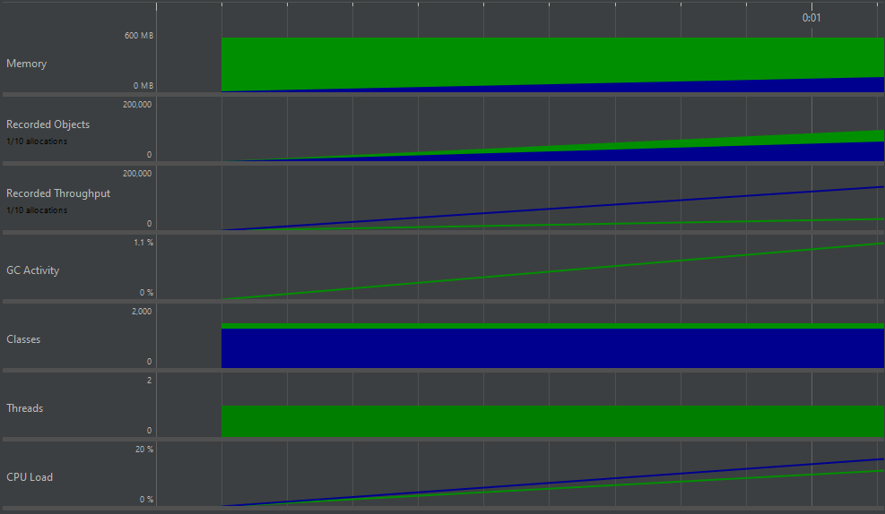
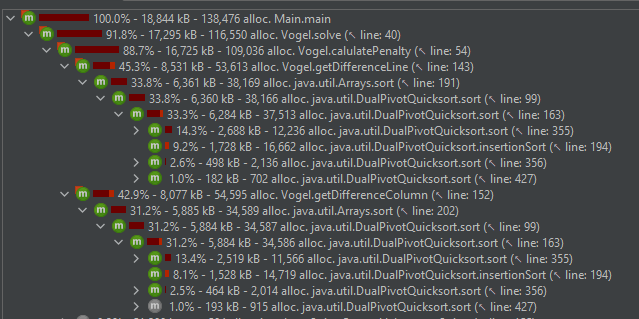
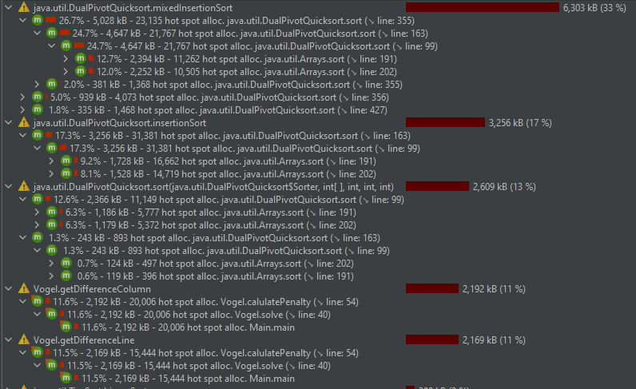
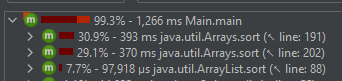
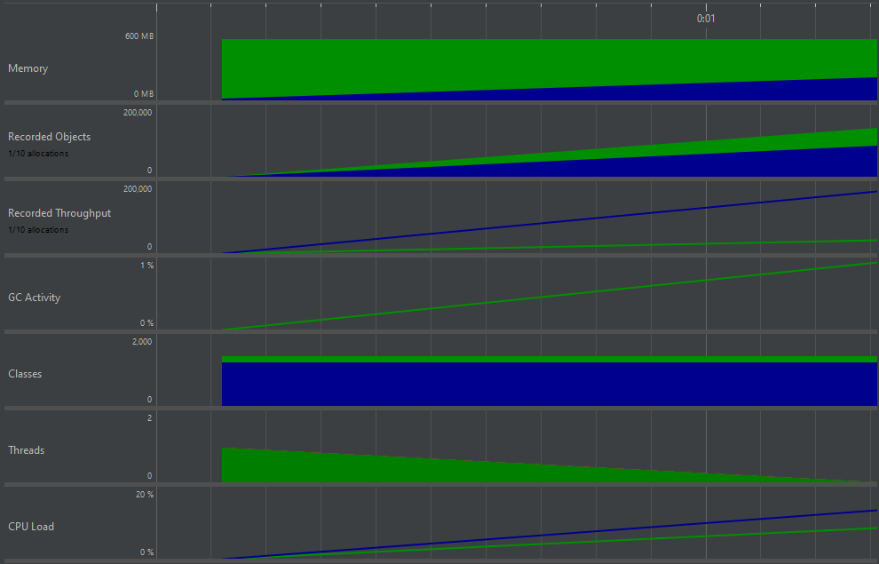
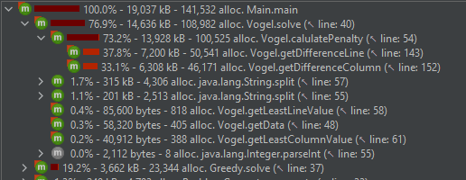
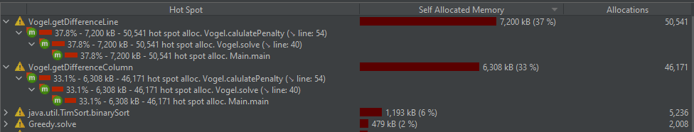
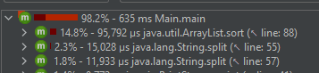

# Analysing the runtime  
  
We ran the profiler under the following circumstances:
* 100 different problems generated
* Each problem had:
  * a minimum of 15 and a maximum of 125 supply for each source
  * a minimum of 15 and a maximum of 125 demand for each destination
  * a minimum of 30 and a maximum of 50 sources
  * a minimum of 30 and a maximum of 50 destinations
  
Using JProfiler, the following results were obtained:

## Telemetries


Nothing out of the ordinary, more and more memory was allocated and the CPU load kept rising until the very end.  

## Allocation Call Tree


Here we can see that the majority of allocations are done in `Vogel.getDifferenceLine()` and `Vogel.getDifferenceColumn()`.

```java
private int getDifferenceLine(int index) {
    int[] values = new int[remainingDestinations];
    int j = 0;
    for(int i = 0; i < demand.length; ++i) {
        if(demand[i] > 0) {
            values[j++] = costMatrix[index][i];
        }
    }
    Arrays.sort(values); 
    //Will sort "values" based on the cost in the unitMatrix
    return Math.abs(values[0] - values[1]);
}

private int getDifferenceColumn(int index) {
    int[] values = new int[remainingSources];
    int j = 0;
    for(int i = 0; i < supply.length; ++i) {
        if(supply[i] > 0) {
            values[j++] = costMatrix[i][index];
        }
    }
    Arrays.sort(values); 
    //Will sort "values" based on the cost in the unitMatrix
    return Math.abs(values[0] - values[1]);
}
```

`Arrays.sort()`, which is called in both methods, is the main cause of this discrepancy between how much allocation is happening in one of Vogel's methods and the rest of the program.

## Allocation Hot Spots


Just as before, the two methods from `Vogel.calculatePenalty()` are the hot spots of memory allocation, because of their `Arrays.sort` method.

## Call Tree


As expected, the CPU spends most of its resources on `Arrays.sort()` calls.

# After optimizing the code  
  
Since `Arrays.sort()` is unnecessarily heavy on both the memory and the CPU, the obvious optimization is to replace it with something more light. After doing so, here are the results on a similar instance: 

## Telemetries


There were a decreasing amount of threads used, as compared to the initial setup.  

## Allocation Call Tree


`Vogel.calculatePenalty()` now only represents 77% of the allocations, whereas, before the optimization, it represented a whopping 92%. A slight increase in performance, but this method still dwarfs the rest of them because we allocate a vector with each call of `Vogel.getDifferenceLine()` and `Vogel.getDifferenceColumn()`.

## Allocation Hot Spots


The two aforementioned methods still are the greatest hot spots.

## Call Tree


Here we see the greatest improvement. From a 68% CPU usage coming from `Vogel.calculatePenalty()` (mainly from the `Arrays.sort()` calls), we are now down to almost nothing. The most CPU-heavy operation happening is the `Arrays.sort()` call from the Greedy Algorithm, `Vogel.solve()` now only representing a bit over 5% of the total CPU usage (from the `String.split()` method calls and others).